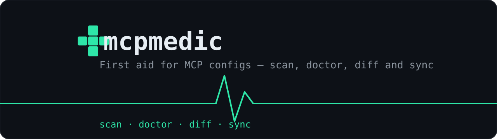

<div align="center">



[](https://github.com/useless-rs/mcpmedic/actions/workflows/ci.yml)
[](https://crates.io/crates/mcpmedic)
[](LICENSE)
[](https://www.rust-lang.org)

**One binary that reads, health-checks, diffs and syncs MCP servers across
every AI tool you use** — Claude Code, Cursor, Windsurf, VS Code, Zed, Codex,
Gemini CLI, Cline, Roo Code, Claude Desktop and opencode.

</div>

---

## The problem

If you use more than one AI coding tool in 2026, you already live it:

- **Claude Code** keeps servers in `~/.claude.json` under `mcpServers`
- **Cursor** uses `~/.cursor/mcp.json`
- **VS Code** wants a `servers` key where every entry *must* have a `type` field
- **Zed** nests everything under `context_servers`
- **Codex CLI** abandoned JSON entirely for `[mcp_servers]` TOML tables
- **Windsurf**, **Gemini CLI**, **Cline**, **Roo Code**, **Claude Desktop** — each
  with its own file in its own corner of your home directory

So the same one-sentence fact — *"there is a Supabase MCP server at this URL"* —
is hand-copied into five files in five dialects. They immediately start to
drift. You update a token in one tool and forget the other four. A dead
`command:` path breaks a tool silently. Nobody can answer "what MCP servers am I
running, and where?" without opening half a dozen config files.

**mcpmedic** is the missing `package.json`-style tooling for that mess: it
normalizes every dialect into one model, health-checks it, shows the drift
between tools, and edits configs **surgically** — never touching a key it
doesn't own, always atomically, always with an automatic backup first.

## Highlights

- 🩺 **`doctor`** — parse errors, dead `command:` paths, VS Code entries
  missing their mandatory `type`, cross-tool config drift, duplicate servers,
  and context-window bloat warnings when a tool is carrying too many servers
- 🔀 **`diff`** — see exactly which servers two tools disagree about
- 🧬 **`sync`** — additive merge from one tool to another (never deletes;
  `--force` overwrites drifted entries)
- 🪡 **Surgical edits** — `add`/`rm` write the *exact* dialect each tool
  expects, preserve every unrelated key, use atomic `write+rename`, and back up
  the previous file to `~/.mcpmedic/backups/` first
- 📦 **`export` / `import`** — portable JSON for dotfile repos, machine
  migration, and team onboarding
- 🛡️ **Read-only where writing is unsafe** — JSONC configs (with comments) and
  opencode are read and diagnosed but never rewritten
- ⚡ **Single static binary**, no Node runtime, no daemon, no config of its own
- ✅ **56 tests**, `clippy::pedantic` clean, cross-platform (Linux / macOS / Windows)

## Supported tools

| Tool | Config (relative to home) | Dialect | Edit |
|---|---|---|---|
| Claude Code | `~/.claude.json` → `mcpServers` (user scope) | JSON | ✅ |
| Claude Desktop | platform app-support dir → `mcpServers` | JSON | ✅ |
| Cursor | `~/.cursor/mcp.json` → `mcpServers` | JSON | ✅ |
| Windsurf | `~/.codeium/windsurf/mcp_config.json` → `mcpServers` | JSON | ✅ |
| VS Code | `~/.vscode/mcp.json` → `servers` (with `type`) | JSON | ✅ |
| Zed | `~/.config/zed/settings.json` → `context_servers` | JSON | ✅ |
| Gemini CLI | `~/.gemini/settings.json` → `mcpServers` | JSON | ✅ |
| Codex CLI | `~/.codex/config.toml` → `[mcp_servers.*]` (honors `CODEX_HOME`) | TOML | ✅ |
| Cline | VS Code globalStorage `cline_mcp_settings.json` | JSON | ✅ |
| Roo Code | VS Code globalStorage `mcp_settings.json` | JSON | ✅ |
| opencode | `~/.config/opencode/opencode.json[c]` → `mcp` (v1 + v2 layouts) | JSONC | 👁 read-only |

Claude Code's `CLAUDE_CONFIG_DIR` and Codex's `CODEX_HOME` environment
overrides are respected. Point `HOME`/`USERPROFILE` at another machine's home
directory to inspect it — handy for dotfile maintenance.

## Install

**From source (any platform with a Rust toolchain ≥ 1.85):**

```sh
cargo install --git https://github.com/useless-rs/mcpmedic
```

**Or build locally:**

```sh
git clone https://github.com/useless-rs/mcpmedic
cd mcpmedic
cargo install --path .
```

Prebuilt binaries for Linux, macOS and Windows are attached to every
[release](https://github.com/useless-rs/mcpmedic/releases).

## Quickstart

```console
$ mcpmedic                       # scan: which tools exist, how many servers
mcpmedic — first aid for MCP configs

  ○ claude-code    ~/.claude.json
  ✓ cursor         ~/.cursor/mcp.json  2 servers
  ✓ opencode       ~/.config/opencode/opencode.jsonc  22 servers
  ○ vscode         ~/.vscode/mcp.json
  ...

$ mcpmedic list                   # every server, every tool, normalized
$ mcpmedic doctor                 # what is broken, drifted or bloated
$ mcpmedic show context7           # where is this server configured?
$ mcpmedic diff cursor windsurf   # the drift between two tools
```

Add a server to a tool — in *that tool's* dialect, with a backup:

```sh
# stdio server
mcpmedic add playwright --to cursor --command npx --env HEADLESS=1 -- -y @playwright/mcp

# remote HTTP server
mcpmedic add github --to zed --url https://api.githubcopilot.com/mcp/ --header "Authorization=Bearer $PAT"
```

```console
  ✓ `playwright` added (stdio) in Cursor
      ~/.cursor/mcp.json
      { "command": "npx", "args": [ "-y", "@playwright/mcp" ], "env": { "HEADLESS": "1" } }
      backup: ~/.mcpmedic/backups/cursor-1790190568842.json
```

Copy your Cursor setup into Windsurf, additively, without deleting anything:

```sh
mcpmedic sync --from cursor --to windsurf          # missing servers only
mcpmedic sync --from cursor --to windsurf --force  # also fix drifted ones
mcpmedic sync --from cursor --to windsurf --dry-run
```

Back up and move everything:

```sh
mcpmedic backup                                   # manual backup of all configs
mcpmedic export --out my-mcp-servers.json         # portable JSON
mcpmedic import my-mcp-servers.json              # restore into every tool
```

## Commands

| Command | What it does |
|---|---|
| `scan` (default) | Detect installed tools and their configs, with server counts |
| `list [--tool <t>]` | Table of every server per tool |
| `show <name>` | Every tool that configures a given server + drift check |
| `doctor [--tool <t>] [--strict]` | Health check: broken JSON, dead commands, dialect violations, cross-tool drift, bloat |
| `diff <a> <b>` | Server drift between two tools |
| `add <name> --to <t> ...` | Add a stdio (`--command ... -- args`) or remote (`--url`) server |
| `rm <name> --from <t>` | Remove one server |
| `sync --from <a> --to <b>` | Additive merge; `--force`, `--names`, `--dry-run` supported |
| `export [--out <file>]` | Dump everything to portable JSON |
| `import <file> [--to <t>]` | Restore an export (per-tool sections or flat `servers` map) |
| `backup [--tool <t>]` | Manual backup (also automatic before every mutation) |

All mutation commands support `--dry-run`.

## Exit codes

| Code | Meaning |
|---|---|
| `0` | Success / doctor found nothing critical |
| `1` | `doctor` found critical findings (or warnings with `--strict`) |
| `2` | Operational error (unknown tool, unparseable target config, …) |

`doctor` is CI-friendly: run it in a dotfiles pipeline and fail the build on
config rot.

## Safety model

1. **Atomic writes** — changes land in a temp file next to the target and are
   `rename`d into place; a crash can never leave a half-written config.
2. **Automatic backups** — the previous file is copied to
   `~/.mcpmedic/backups/<tool>-<epoch-millis>.<ext>` before every mutation.
3. **Surgical edits only** — mcpmedic never rewrites keys it doesn't own. Your
   `numStartups`, themes, model settings and comments (in TOML) are preserved.
4. **Read-only where risky** — configs with JSONC comments and opencode's
   moving-target format are parsed and diagnosed but never written.
5. **Refusal, not heroics** — a config with a parse error is reported, never
   edited.
6. **Additive sync** — `sync` never deletes servers from the target.

## Why not a GUI or a gateway?

Existing solutions are mostly macOS-only menu-bar apps, hosted gateways, or
npm scripts. mcpmedic is for everyone else: a 2 MB static binary that runs on
any OS, inside CI, over SSH, on a teammate's machine — no runtime, no daemon
between you and your tools, no config stored anywhere but the configs
themselves.

## Roadmap & backlog

Scored by impact (I 1-5), effort (E 1-5), risk (L/M/H). One item per
improvement cycle; log in [`CONTRIBUTING.md`](CONTRIBUTING.md#improvement-log).

| # | Item | I | E | Risk | Status |
|---|---|---|---|---|---|
| 1 | Shell completions (`mcpmedic completions bash\|zsh\|fish\|powershell`) | 4 | 2 | L | **next up** |
| 2 | `doctor --fix` for safe auto-repairs (VS Code missing `type`, Zed legacy migration) | 4 | 3 | M | planned |
| 3 | `enable` / `disable` servers without removal (Codex `enabled`, opencode `enabled: false`) | 3 | 3 | L | planned |
| 4 | Project-scoped configs (`.mcp.json`, `.cursor/mcp.json`, `.vscode/mcp.json`) | 4 | 4 | M | planned |
| 5 | `--json` machine output for `scan` / `list` / `doctor` | 3 | 3 | L | planned |
| 6 | More tools: Warp, Kiro, JetBrains, TRAE, Antigravity | 3 | 2 | L | planned |
| 7 | Social preview PNG upload (SVG ready in `docs/brand/`) | 2 | 1 | L | needs repo owner |
| 8 | Absolute image URLs before `cargo publish` (crates.io can't render relative SVGs) | 2 | 1 | L | pre-publish step |
| 9 | MCP reachability probe in `doctor` (spawn / HTTP HEAD with strict timeouts) | 4 | 4 | H | someday |

Explicit non-goal: telemetry, ever. A config doctor that phones home would be
a bad joke.

Contributions welcome — the [tool registry](src/registry.rs) is a single file
and adding a new tool is ~15 lines.

## Brand

mcpmedic's identity is **"a first-aid station in your terminal"**: a medic cross
with a prompt carved in it, a heartbeat line, monospace type, dark surfaces,
and exactly one accent color. Canonical assets live in
[`docs/brand/`](docs/brand/) — use them as-is; don't redraw or recolor them.

| Token | Hex | Role |
|---|---|---|
| Ink | `#0D1117` | Dark surfaces (logo/terminal background) |
| Paper | `#E6EDF3` | Wordmark and text on dark |
| Mint | `#2EE6A8` | The single brand accent: the cross, the heartbeat line, verb chips |
| Slate | `#8B949E` | Muted text, taglines |

Rules distilled from the broader CLI brand canon (bat, eza, NixOS, and
friends):

- **Wordmark** is `mcpmedic` — monospace, lowercase, always matches the command.
- **Mint is the spark** — it marks brand moments only (logo, scan header, help
  literals). Success/warning/critical/info in `doctor` output are *semantic*
  colors (green/amber/red/blue) and are never recolored to mint.
- **Flat colors only** — no gradients, glows, shadows or 3D on the marks.
- The isotype must survive as a plain silhouette at 16 px (favicon, tab bar).
- Dark backgrounds are the default for brand surfaces.

Assets: [`logo.svg`](docs/brand/logo.svg) (512×512 isotype) ·
[`banner.svg`](docs/brand/banner.svg) (1280×360 README hero) ·
[`social-preview.svg`](docs/brand/social-preview.svg) (1280×640 — export to PNG
and upload in repo *Settings → Social preview*).

## License

[MIT](LICENSE) © 2026 useless-rs
